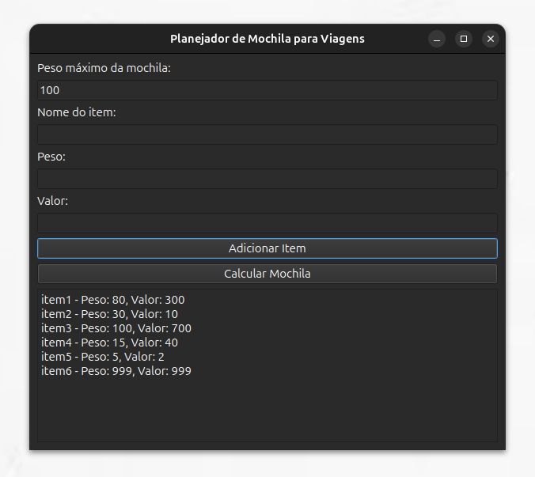

# Greed_MochilapraViagem

**Número da Lista**: 4<br>
**Conteúdo da Disciplina**: Algoritmos Ambiciosos<br>

## Alunos
|Matrícula | Aluno |
| -- | -- |
| 22/2037648   |  André Cláudio Maia da Cunha |
| 21/1062713 |  Paola Rebeca Lima do Nascimento  |


## Sobre 
Para este trabalho, a dupla irá realizar um Planejador de Mochila para Viagens, praticando com algoritmo que sigue a intuição de Algoritmos Ambiciosos (Knapsack).
Onde um viajante tem uma mochila com capacidade limitada (peso máximo), e ele precisa escolher itens para levar. Cada item tem um peso e um valor associado. 
O objetivo é maximizar o valor total dos itens escolhidos sem exceder o peso máximo da mochila.


## Screenshots





## Instalação 

**Linguagem**: Python3<br>

#### 1. Crie o ambiente virtual:
```bash
python3 -m venv venv
```

#### 2. Ative o ambiente virtual:
##### No Linux/MacOS:
```bash
source venv/bin/activate
```
##### No Windows:
```bash
venv\Scripts\activate
```
#### 3. Com o ambiente virtual ativo, instale as dependências:
```bash
pip install -r requirements.txt
```

#### 4. No diretório src execute o programa:
```bash
python3 main.py
```

## Uso 

#### 1. Adicione, no primeiro campo, o peso máximo da mochila;
#### 2. Adicione as informações do item (nome, peso e valor) nos campos consecultivos;
#### 3. Clique em "Adicionar Item" para adicionar o item preenchido;
#### 4. Quando estiver satisfeito de adicionar os itens, clique em "Calcular Mochila" para ver o Knapsack sendo executado.


## Link do Vídeo

[Clique Aqui!](https://youtu.be/k1_0dg820ks)
